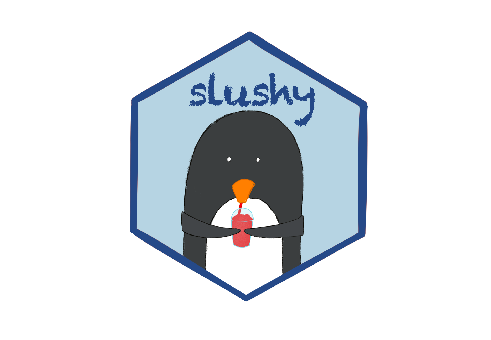

# {slushy} 

## About

{slushy} is a wrapper built on {renv} to mirror a controlled R environment through CRAN snapshots and an agreed set of packages.

The {slushy} package aims to support the following:

- *Reproducible workflows* with {renv} as the engine 
  - Initialize, update, sync, and check status of the environment
- *Stable environments* via Dated CRAN snapshots from Posit Package Manager. 
  - Use of a snapshot helps ensure compatibility between packages and portability of the environment
- *Use of a fixed set of packages* 
  - Limit installation to an agreed upon set of packages
  - Identify use of non-agreed packages 
- *Seamless updates*
  - Utilize the latest and greatest features in the R ecosystem or revert back in time


## Installation

You can install the development version of {slushy} like so:

``` r
devtools::install_github("GSK-Biostatistics/slushy")
```

*Note:* {renv} is a key dependency of {slushy}. While {renv}>0.17.0 is supported, for best results, it is currently recommended to stick with 0.17.1-0.17.3 for use with {slushy} 

## Use

Actions available in {slushy} primarily fall into 2 categories: (1) initialization and maintenance of the environment, and (2) use of the environment. Please reference the corresponding vignettes for specifics. 


## More information

More details about configurations can be found in the pkgdown site.  
